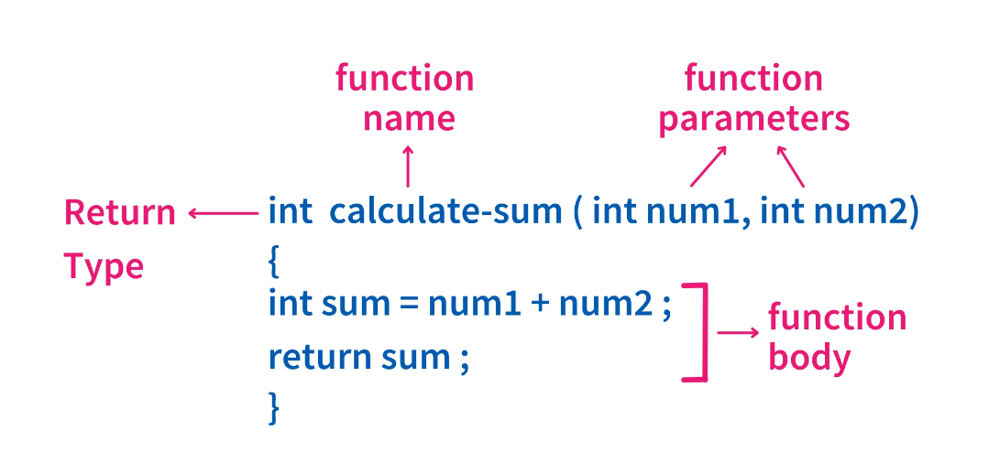

<h1 align="center">C++ Basic to Advanced</h1>

There are **95 keywords** in **C++**, of which around **30** are not-available in the **C** Language. <br>
```c++
int, long, break, void, auto, return, case, char, const, continue, default, do, double, else, enum, extern, float, for, goto, if, long, register, short, signed, sizeof, static, struct, switch, typedef, union, unsigned, volatile, while. 
```
## 1 - DataType:
There are Three type of DataType in C++ Programming. 

**Primitive DataTypes** : 
```c++
int, float, char, bool, double float, void, wchar_t. 
```
**Derived DataTypes** : 
```
Function(), Array[], Pointer(*), Reference(&).
```
**Abstract/User-Defined DataTypes** :
```c++
class(), struct(), union(), enum(), typedef() 
```
## Operators:
-   **Unary Operators:**
    -   It is only a single operand, Increment `++` and Decrement `--`.   

-   **Binary Operators:**   It is require two operands to acts like, 

|No. |    Operator         |value |
|:---|:--------------------|:----:|
|1	 |Arithmetic operators |`+`, `-`, `*`, `/`, `%`|
|2	 |Relational Operators |`==`, `>=`, `<=`, `!=`|
|3	 |Logical Operators    |`&&` , `OR`|
|4	 |Assignment Operators |`=`, `+=`, `-=`, `*=`, `/=` | 
|5	 |Bitwise Operator     |`^ `, `~` |

-   **Ternary Operator:**
    -   The operator that require three operands to act.
    -   ```(a != b)? True : False;  ```

-   **Other Operators:**
    -   SizeOf Operator:
        -   The `sizeof` the operator is used to compute the size of the variable.   ex: `sizeof(int)`.
    -   Comma Operator `,`:
        -   Comma (`,`) acts as both operator and separator, and its lowest precedence.
```c++ 
int test;   // declaration
test = 5;   // initialization
cin>>n;     // Input
cout<<n;    // Output (Display)
```
## 2 - Introduction of Loops:
The C++ for loop is used to iterate a part of the program several times. If the number of iteration is fixed, it is recommended to use `for`, `while` & `do-while` Loops. The C++ for loop is same as C++. We can initialize variable, check condition and increment `++`/ decrement `--` value.

**For loop:**
```c++
for(init_expt; test_exp; update){
        // statements to execute in the loop body
    }
```
**While Loop:**
```c++
while (test_expression){
    // statements to execute in the loop body
    update_expression;
}
```
**Do While loop:** <br>
*Note: It will execute at least once irrespective of test condition.*
```c++
do{
    // statements to execute in the loop body
    update_expression;
}while(test_expression);
```
## Decision-Making Statements:

1.  **If-Else Statement in C++:**
    -   It is the most simple decision-making statement. A certain condition is true then a block of statement is `executed` otherwise `not`. 
```c++
if (condition) {
    // Executes this block if condition is true
}
else {
    // Executes this block if condition is false
}
```
2. **Break and Continue Statement:**
    -   **Break Statement:** Stops the entire process of the loop. also terminates the remaining iterations.
    -   **Continue Statement:** Only stops the current iteration of the loop & doesn't terminate the next iterations; it resumes with the successive iterations.

3.   **Switch-Case Statement:**
    -   Use the switch statement to select one of many code `blocks` to be executed.
```c++
switch(expression) {
    case x:
        // code block x
        break;  // stops the entire process
    case y:
        // code block y
        continue;   // doesn't terminate the next iterations
    case z:
        // code block z
    default:
        // code block not match x, y & z then executed.
}
```
## 4 - Star Pattern for Practice:
In any programming language, star patterns are one of the common patterns that are widely used because it helps to improve logical thinking and flow control knowledge. ***To create pattern in the C++ language, you just have to use two loops or three loops.***

## 5 - Function:
*Function is a piece of code that preforms a specific task & can be called many times.* 

### Types of Functions:

1.  **Built-in Function:** *Built-in functions are standard library functions in C++*. These header files and `STL` *(Standard template library)*. Header files are special files with `.h extension`. We have to include the header file of the function before calling it using the include directive. <br> 
*Header file* - `<cmath>` , `<algorithm>` etc...<br>
*built-in function* - `pow()`, `sqrt()`, `min()`, `max()`
etc..
2.  **User-defined functions:** *Functions created by the user for custom requirements. It reduces complexity of a big program and optimizes the code*. <br>
Such as `sum(int, int)`, `swap(int, int)`, `void display()` etc...

**Creating Function in C++:**
<p align="center">
        
</p>

### Function Parameters:
-   **Paramaters/Arguments:** <br>
It pass `Name` to function as parameter `Surname` & print the full name.
```c++ 
void myfunction(string Name){
    cout<<Name<< "Surname";     // Output: Name Surname
}
```
-   **Default Parameter:** <br>
It is default value, by using equals sing `=`.
```c++
void myfunction(string country="India"){
    cout<<country;  // call myfunction("Sweden") = Output: Sweden  
    cout<<country;  // call myfunction() default = Output: India
}
```
-   **Multiple parameters:** <br>
Inside the function, you can add as many parameters as you want:
```c++
void myfunction(string Name, int age){
    cout<<Name<<" Surname "<<age;  }
// call myfunction("adarsh", 12) = Output: adarsh Surname 12
// call myfunction("ayush", 20) = Output: ayush Surname 20
// call myfunction("ankita", 5) = Output: ankita Surname 5
```
-   **Return values:** <br>
If you want the function to `return` a value, you can use a `dataType` inside the function.
```c++
int myfunction(int x) {
    return 5 + x;   }
int main(){
    cout<<myfunction(3);
}// Output: 8 (5 + 3)
```
-   **Pass by Reference:** 
```c++
void swap(int &x, int &y){
    int z = x;
    x = y;
    y = z;
} // Output: a=b, b=a;
```
-   **Pass Arrays:**   You can also pass `Array` to a function.
```c++
void myfunction(int arr[], int n){
    for ( int i=0; i<n; i++){
        cout<<mynumber[i]<<" ";
    }
}
```
-   **Recusion Function:** 
```c++
int sum(int k){
    if(k > 0)
        return k + sum(k - 1);
    else
        return 0;
}
```
### Function Overloading:
It has multiple function can have the **"Same Function_name with Different Parameters"**.
```c++
#include <iostream>
using namespace std;
int myfunction(int x, int y) {
    cout<< (x + y);
}
float myfunction(float x, float y) {
    cout<< (x + y);
}
int myfunction(int x, int y, int z){
    cout<< ((x + y) - z) ;
}
int main(){
    int a=10, b=20, c=30, d=3.14 e=3.14;
    myfunction(a,b);
    myfunction(d,e);
    myfunction(a,b,c);
    return 0;
}   
```
## 6 - Time Complexity:
**Time complexity** of any algorithm is the time taken by the algorithm to complete. It is an important metric to show the efficiency of the algorithm and for comparative analysis. We tend to reduce the time complexity of algorithm that makes it more effective.

**There are different types of time complexities used, let’s see one by one:**
<!-- 
<p align="right">
 -->
|Sr. | Time | value |
|:---|:-----|:-----:|
|1.  | Constant time | **O(1)** |
|2.  | Linear time | **O(n)** |
|3.  | Logarithmic time | **O(log n)** |
|4.  | Quadratic time | **O(n^2)** |
|5.  | Cubic time | **O(n^3)** |

## 7 - Array:

Arrays are used to store multiple values in a single variable, instead of declaring separate variables for each value.

To declare an array, define the variable type, specify the name of the array followed by square brackets and specify the number of elements it should store:
```c++
int array[4] = {40,45,50,55}; // declaration
int =  4 Bytes                // 4 X 4 bytes = 16 bytes
```
## 8 - 2D Array:

**The multidimensional Array is also known as Rectangular Arrays in C++**. It can be two dimensional or three dimensional. The data is stored in tabular form (row ∗ column) which is also known as matrix.
```c++
int main(){
    int arr[n][m];  //declaration of 2D array
    bool arr[n][m];
    char arr[n][m];
    float arr[n][m];
}
```
## 9 - Pointer (Important Topic):

**"Pointers are variables that store the address of other variables."** Getting started with the Pointers.Every variable is stored in the memory and each memory location has its own memory address. It enables us to pass variables by reference.

**`&` Operator:** It gives the address of the variable.

**`*` Operator:** It gives the value stored at the address, i.e dereferences the value stored at the address. *example:-*
```c++
void swap(int *a, int *b){
int temp = *a;
*a = *b;
*b = temp;
}
```
## 10. STL-Strings:

|Sr. |**Character Array:**                                          |**String:** |
|:--:|:-------------------------------------------------------------|:---------------------------|
|1.  |Need to know size beforehand.                                 |Need to know size beforehand.|
|2.  |Larger size required for operation (concatenates or append).  |Performing operation like concatenating and append is easier.|
|3.  |No terminating extra character.                               |Terminated with a special character ‘\0’.|

**Built-In Function:-**
```c++
    getline(cin, s);        // input string
    s1.append(s2);          // insert s1+s2
    s.assign("Ribh");       // s = "Ribh"
    cout<<s.at(3)<< endl;   // particular position
    s.begin();              // first character
    s.end();                // last character
    s.clear();              // Erases all the contents
    s2.compare(s1)          // s2 - s1
    s.c_str();              // C-style string
    s.empty();              // string is empty
    s.erase();              // Deletes a substring
    s.find();               // Searches the string
    s.insert();             // Inserts additional characters
    s.length();             // Returns the length of the string
    s.size();               // Returns the length of the string
    s.resize();             // Resize the string to the new length
    s.substr(3, 4);         // copy of the string 3 to 4 is 3456
    stoi(s);                // strings convert to a integer
    to_string(s);           // convert integer to a string
    sort(s.begin(),s.end());                                // use sort() function
    transform(s.begin(), s.end(), s.begin(), ::toupper);    //convert upper
    transform(s.begin(), s.end(), s.begin(), ::tolower);    //convert lower
    sort(s.begin(), s.end(), greater<int>());               //sorting greater to lower
    sort(s.begin(), s.end(), greater<int>());               // 999887443 sort
```
## 13. Recursion:-
**Definition:** *It is when a function all itself to make the problem smaller.* <br>
Ex: To get the sum of the first 'n' number using recursion.
```c++
int sum(int n){
    if(n==0){
        return 0;
    }
    int prevsum = sum(n-1);
    return n + prevsum;
}
```
## 14. Permutation:
**A permutation**, also called an **arrangement number** or **order**, is a rearrangement of the elements of an ordered list S into a one-to-one correspondence with S itself. A string of length n has `n!`** permutation.

**Below are the permutations of string ABC.**
```
“ABC”, “ACB”, “BAC”, “BCA”, “CBA”, “CAB”
```
## 15. Object-Oriented Programmings: (Oop's)

- **Classes -** Basic template for creating objects.
- **Objects –** Basic run-time entities.
- **Data Abstraction** & **Encapsulation –** Wrapping data and functions into a single unit.
- **Inheritance –** Properties of one class can be inherited into others.
- **Polymorphism –** Ability to take more than one forms.
- **Dynamic Binding –** Code which will execute is not known until the program runs.
- **`Message Passing –** message (Information) call format.

#### Difference between Pop’s and Oop’s:

|No.|**POP's**|**OOP's**
|:--:|:----------------------------------|:---------------|
|1.|Consists of writing a set of instruction for the computer to follow.|Works on the concept of classes and object.
|2.|The main focus is on functions and not on the flow of data.|A class is a template to create objects.
|3.|Functions can either use local or global data.|  Treats data as a critical element.
|4.|Data moves openly from function to function.| Decomposes the problem in objects and builds data and functions around the objects.

